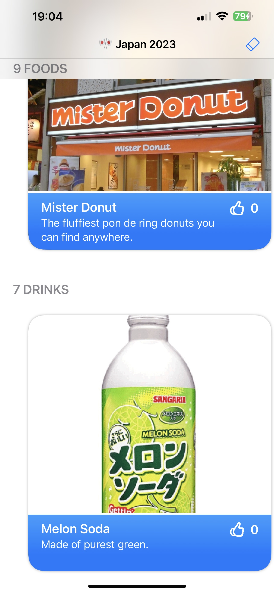

#  Level Up Your SwiftUI

https://www.youtube.com/watch?v=l7eut-nYIUc

Tłumaczenie audiodeskrypcji

Ten film nosi tytuł "Podnieś swój SwiftUI". Celem tutaj jest pomóc Ci podejść krok po kroku do poprawy swojego kodu, począwszy od starszego kodu SwiftUI, aż do nowszego, lepszego kodu SwiftUI. Być może zauważyłeś w tym roku, że Apple delikatnie zmieniło logo SwiftUI. Stare po lewej, nowe po prawej. Myślę, że to się stało, ponieważ wprowadzili również Swift Data. I umieściliśmy te dwa loga obok klasycznego logo Swift. Nazwałem te trzy razem logami ptaka. Jeśli się zastanowisz, w zeszłym roku dodali Swift Charts. Swift Charts nie dostał logo ptaka. Myślę, że to jest celowe. Myślę, że Apple daje nam tutaj sygnał. To, co widzimy, to nowe Coco. Ponieważ w starej metodzie tworzenia aplikacji w Objective-C używałbyś Foundation do wszystkich swoich standardowych bibliotek. Używałbyś AppKit do wszystkich swoich elementów interfejsu użytkownika. A do przechowywania i zarządzania danymi używałbyś Core Data. A teraz mamy Swift, standardową bibliotekę. Mamy SwiftUI. I mamy SwiftData. To jest nowe Coco. W każdym razie, ta prezentacja skupia się tylko na części SwiftUI. Tutaj nie ma SwiftData, ani obserwacji i podobnych, tylko czysty kod SwiftUI. Zobaczysz wiele rzeczy, które są nowe w iOS 17. Niektóre rzeczy będą działać już w iOS 16. Kilka rzeczy będzie działać wstecz do iOS 15, a nawet wstecz do iOS 14, i wierz lub nie, nawet wstecz do iOS 13. W każdym razie, zaczynajmy. W tym roku miałem wakacje w Japonii, gdzie widziałem wiele bardzo starych rzeczy, oraz wiele bardzo nowych rzeczy, zanurzyłem się w różnorodnej kulturze i oczywiście jadłem mnóstwo jedzenia. Gdybym był normalny, zakończyłbym tutaj i cieszył się Japonią, świetnie się bawiąc. Ale jesteśmy programistami. Więc to, co zamierzamy zrobić, to stworzyć aplikację opisującą nasze doświadczenia.


### Dopasowanie scrolowania

W naszym przypadku stworzyłem tutaj aplikację na rok 2023 związana z Japonią. Jak widzisz, jest tu wiele potraw, przez które mogę przesuwać palcem, aby zobaczyć rzeczy, które mi się podobały w Japonii. Mogę przesuwać się w pionie, aby zobaczyć napoje, a potem przejść dalej i zobaczyć aktywności - rzeczy, które robiłem w Japonii. Aplikacja ma także funkcję wyszukiwania. Mogę np. wpisać coś prostego, jak "Shin", i znajdzie Yoshinoya. Jest także przycisk "Lubię" do oznaczenia, że zrobiłem daną rzecz.  Jest celowo bardzo, bardzo prosta .To taka mała piaskownica dla naszych nowych funkcji. Patrzymy na kilka widoków rozłożonych na ekranie poziomo, i to samo w pionie dla różnych kategorii. I gdy użytkownicy przesuwają się między rzeczami, po prostu przesuwamy je jedno miejsce na raz, za każdym razem. Ale co się dzieje, gdy użytkownik wraca do połowy elementu? 


To jest bardzo dziwne miejsce. Nie można naprawdę zobaczyć niczego użytecznego na ekranie. I to widać w naszej aplikacji. Tutaj, jeśli po prostu przesuwam się między różnymi rzeczami, mogę powiedzieć: "To fajne, ale zostawmy to tutaj". Albo co gorsza, zatrzymać się poziomo, a potem także częściowo w pionie. Aplikacja jest teraz w zupełnie bezużytecznym stanie. Nie można widzieć niczego w pełni na ekranie. To jest teraz proste do poprawienia w iOS 17.


Istnieje teraz nowy modyfikator dla widoków przewijalnych nazywany  `.scrollTargetBehavior(.viewAligned)` , mozemy tam uzyc `.pagging`, co oznacza, że w miarę przesuwania przez użytkownika, przesuwamy o całą stronę zawartości na raz. Lub możemy powiedzieć  `.scrollTargetBehavior(.viewAligned)`, co oznacza przewijanie między różnymi widokami, które podaję, przeskakując do każdego z nich osobno, a nie całe strony naraz. Jak powiedzieć, do którego elementu przeskoczyć? To proste. Możemy użyć  `.scrollTargetLayout()` dla całego kontenera, takiego jak H stack lub V stack. Będzie przeskakiwać do poszczególnych elementów wewnątrz tego widoku. To naprawdę proste i bardzo przydatne. Oto nasz kod. 

```swift
struct ListingView: View {
    ...
    var body: some View {
        NavigationStack {...

                        ScrollView(...)
                            .padding(.horizontal, 20)
                            .scrollTargetLayout()
                        }
                        .listRowInsets(EdgeInsets())
                        .scrollTargetBehavior(.viewAligned)
                    } header: {
                        Text(dataModel.title(for: category))
                            .font(.title3.bold())
                            .textCase(.uppercase)
                    }
  ...
```


Zobaczysz, że to jest nasz główny widok listy. Mamy tutaj dużą listę treści, idących w dół ekranu. Wewnątrz niego pętlujemy przez wszystkie nasze kategorie, czyli jedzenie, napoje, aktywności. Wewnątrz nich odczytujemy wszystkie elementy dla danej kategorii. Każdy z nich pokazujemy w osobnym widoku przewijalnym, rozciągniętym poziomo. W tym widoku przewijalnym mamy H stack zawierający treść dla wszystkich potraw lub napojów. Wewnątrz tego pętlujemy przez każdą rzecz za pomocą widoku "item view", który pokazuje każdy element na ekranie. Więc mieliśmy tam salon gier, maszyny gacha i podobne. Jest także trochę marginesu dla tego wewnętrznego H-Stack, aby elementy nie wychodziły na brzegi ekranu. Potrzebuje trochę przestrzeni. Teraz zaktualizujemy to na iOS 17. Zacznijmy od dodania nowego modyfikatora do widoku przewijalnego, mówiąc, że "scroll target behavior" to "view aligned". Przeskakuj do dzieci wewnątrz widoku przewijalnego, które mu podam. W tej chwili to jeszcze nic, ale powiemy temu HStackowi wewnątrz widoku przewijalnego, że chcemy, aby przeskakiwał do każdego dziecka wewnątrz niego. Każdy "item view" powinien być przeskakiwany, gdy przewijamy widok przewijalny. To tylko dwie linie kodu, dwa nowe modyfikatory dla naszego kodu SwiftUI, ale efekt jest naprawdę świetny.


Wracając do naszego kodu, teraz mogę przesuwać się między różnymi widokami i zauważysz, że każdy przeskakuje do indywidualnych elementów w kategorii jedzenia po jednym. Jeśli spróbuję wrócić częściowo i puścić, nagle przeskoczy do najbliższego widoku. W tym przypadku "Eki-ben".W każdym razie to duże ulepszenie, ale daleko od ideału. Spójrz na to na przykład. Widzimy białą przestrzeń po lewej stronie. To nie jest dobra rzecz. Chcieliśmy odstępu wcześniej, aby nie wypełniało ekranu całkowicie i nie wylewało się wszędzie. Teraz wygląda na zepsute. Jest to spowodowane wcześniejszym modyfikatorem "padding". Dodawanie trochę odstępu było dobre, ale teraz dodaje twardą białą linię z obu stron. To nie jest idealne. Modyfikator "padding", jak wiesz, jeśli masz długi widok przewijalny z zawartością i zastosujesz "padding" do tej zawartości, to przytnie ją od krawędzi początkowej i końcowej tej zawartości. Tutaj mówię  `.padding(.horizontal, 20)` to przytnie zawartość od krawędzi początkowej i końcowej o 20 wewnątrz widoku przewijalnego. Jeśli dodamy 40, to przytnie jeszcze bardziej. To działa dobrze dla prostego odstępu. Ale nie chcemy tego tutaj. Zamiast tego użyjemy nowego modyfikatora iOS 17, który nazywa się  `.contentMargins(20, for: .scrollContent)`,. Zmienia on obszar bezpieczny wewnątrz widoku przewijalnego. Rzeczy przewijane wewnątrz niego przewijają się w mniejszej przestrzeni. Oto 20 lub 40, tak jak to. To działa naprawdę, naprawdę dobrze. Użyjmy tego samego rozwiązania w naszym kodzie. W tej chwili mamy twardo zakodowany modyfikator "padding" o okropnej wartości 20. Nie chcemy tego już. Usuńmy ten modyfikator i zamiast tego powiedzmy, że nasz widok przewijalny ma nowy modyfikator "content margins". Znowu używamy wartości 20, tej samej wartości, określając zawartość widoku przewijalnego. Przyciśnij obszar bezpieczny o podaną liczbę. Krytyczne jest również, aby przenieść modyfikatory `.listRowInsets(EdgeInsets())` na koniec listy modyfikatorów dla tego widoku. Zawsze mów, że nie ma kolejnych wcięć po tych, o których ci powiedziałem. 

```swift
ScrollView(.horizontal, showsIndicators: false) {
  HStack {
    ForEach(items) { item in
                    ItemView(item: item)
                   }
  }
  .scrollTargetLayout()
}
.scrollTargetBehavior(.viewAligned)
.contentMargins(20, for: .scrollContent)
.listRowInsets(EdgeInsets())
```


To niewielka zmiana. Dodanie kolejnego modyfikatora, usunięcie jednego z modyfikatorów, ale działa to tak dobrze. Wracając jeszcze raz do naszego kodu, teraz mogę przesuwać się między różnymi potrawami. Jak widzisz, teraz wypełniają ekran od krawędzi do krawędzi. Dużo bardziej estetycznie. Ale nadal nie jest idealnie. Jak widzisz, jeśli wywołam ten widok, zwróć uwagę na krawędzie początkową i końcową. Nie są równe. Są obie widoczne, co jest świetne. Od krawędzi do krawędzi, co jest wspaniałe. Ale nie są równe. 


Możemy zrobić to lepiej. Znowu mamy nowy modyfikator iOS 17, który nazywa się "containerRelativeFrame". Pozwala nam powiedzieć, że ten widok potomny powinien mieć rozmiar oparty na rozmiarze jego rodzica. W tym przypadku mówimy, że rozmiar poziomy tego widoku ma być oparty na rozmiarze poziomym jego kontenera. Podajemy także rozmiar i osie, mówiąc, że oto rozmiar rodzica, jak duży powinien być ten widok potomny? Możemy na przykład powiedzieć, że dziecko powinno mieć rozmiar 0,5 rozmiaru rodzica, czyli na przykład połowę szerokości widoku rodzica. Albo może 0,333, czyli jedną trzecią szerokości widoku rodzica.


Istnieje bardziej zaawansowana alternatywa, która obejmuje osie (axis), liczbę (count), zakres (span) i odstęp (spacing). 

```swift
 .containerRelativeFrame(.horizontal, count:5,span:2, spacing: 0)
```

To oznacza, że chcemy podzielić nasz widok nadrzędny na 5 równych kolumn szerokości i każdy widok potomny wewnątrz ma stanowić dwie z tych pięciu kolumn. Zakres dwóch spośród pięciu. Lub możemy powiedzieć, że chcemy obejmować cztery spośród pięciu. To zależy od Ciebie. To jest bardzo elastyczne. Ale co najlepsze, najprostsza wersja "containerRelativeFrame" jest banalna `.containerRelativeFrame(.horizontal)`. W tej wersji oznacza to, że chcemy dopasować pełną szerokość naszego kontenera po odjęciu obszaru bezpieczeństwa. I to jest idealne w tym przypadku. Ponieważ właśnie użyliśmy "content margins", aby dostosować obszar bezpieczeństwa w poziomych widokach przewijalnych. 

Teraz w naszym kodzie mamy widok `ItemView`, który pokazuje jeden element w naszym układzie. Mogę kliknąć prawym przyciskiem na ten widok i wybrać "Przejdź do definicji". Następnie przewinąć się w dół tego układu jednego widoku w jedzeniu, napojach lub czymkolwiek, i odnaleźć to: "fixed frame width" zawsze wynoszący 320. To może działać wcześniej, ale teraz chcemy coś lepszego. Chcemy elastycznego rozmiaru zgodnie z widokiem nadrzędnym, do którego jest przypisany. Więc usunę to i zastosuję nowy modyfikator iOS 17, którym jest "containerRelativeFrame". Powiem, że dopasuj szerokość kontenera poziomo. 

```swift
struct ItemView: View {
  ...

ZStack(alignment: .bottom) {...}
.containerRelativeFrame(.horizontal)
```

To zmiana jednej linii. Bardzo prosta, ale efekt jest znakomity. Otrzymujemy taki układ, że przewijając się między widokami, mamy równą ilość informacji przed i po bokach. Równe rozmiary treści wewnątrz. To jest praktycznie klasyczny układ widoku w sklepie App Store, który pokazuje wskazówki dotyczące przewijania, pokazując, co pojawia się przed i po tym, co jest aktualnie widoczne, co ułatwia wizualne przewijanie. Jest to bardzo przyjemne i łatwe do wykonania. A teraz mamy naprawdę inteligentne przewijanie w naszej aplikacji. Użyliśmy modyfikatora "scroll target behavior", mówiąc, że przewiń do widoków, które Ci podaję. I mówimy, które widoki mają być przewijane, mówiąc, że są to widoki z "scroll target layout". Przesuń do wszystkich tych widoków w "HStack". Następnie zastosowaliśmy "content margins", aby dostosować obszar bezpieczeństwa dla widoku przewijalnego. I wreszcie powiedzieliśmy, że chcemy również zastosować "container relative frame" poziomo, aby widoki potomne dopasowały się do pełnej szerokości widoku przewijalnego pomniejszonej o ten obszar bezpieczeństwa. Teraz wszystkie te funkcje wymagają iOS 17. Istnieje więc duża szansa, że pomyślisz: "Poczekaj chwilę. Nie mogę z nich korzystać przez jakiś czas. Muszę obsługiwać wersję 16 lub 15". Wróćmy więc i przyjrzyjmy się nieco starszemu kodowi, który nadal jest bardzo wartościowy dla Twojego projektu.


Na przykład, tutaj, w tym pliku widoku elementu, na linii 51, możesz zobaczyć, że mamy zaokrąglony prostokąt o promieniu zaokrąglenia równym 25. Teraz ile razy pisałeś kod w ten sposób? Prawdopodobnie wiele razy. Nowość! Od Xcode 15 i dalej, możemy teraz po prostu powiedzieć ClipShape.RectCornerRadius 25 i uzyskać dokładnie ten sam wynik.

```swift
    var body: some View {
        ZStack(alignment: .bottom) {...}

       // .clipShape(RoundedRectangle(cornerRadius: 25))
        .clipShape(.rect(cornerRadius: 25))
```

 Zaokrąglony prostokąt o zaokrągleniu 25 punktów. Co najlepsze, to działa wstecz do iOS 13. Wewnętrznie wywołuje starszy konstruktor dla zaokrąglonych prostokątów, z zaokrągleniem krawędzi i stylem. Krytyczne jest to, że jest oznaczone jako "zawsze wyemituj" po stronie klienta. Skopiuj ten kod do swojego projektu podczas kompilacji, dlatego działa wstecz do iOS 13, o ile masz Xcode 15 lub nowszy. A propos, chwilowo chciałbym powiedzieć, że jeśli wrócę do .req i zapytam "jakie inne opcje są dostępne", zobaczysz nową opcję w .rect tutaj,  `.clipShape(.rect(cornerRadii: wartosc)).` A to pozwala na stworzenie nierównego zaokrąglonego prostokąta, gdzie możesz powiedzieć, na przykład, zaokrąglić te dwie krawędzie, ale pozostaw te dwie proste. To pełna kontrola nad zaokrąglaniem krawędzi. I działa to wstecz do iOS 16. W każdym razie, nie chcemy tego tutaj, więc cofnijmy tę zmianę i zostawmy to tak, jak to było. Zamiast tego spróbujmy czegoś innego. 

### Zmiana definiowania niektorych elementow np button

Powiedzmy: "Co jeszcze możemy zrobić?" Przejdźmy do obszaru wyszukiwania i dodajmy jeszcze jedno świetne ułatwienie, które możemy przyjrzeć się. Tym razem przyciski. Przyciski, zobaczysz, mamy dwa w naszym projekcie. Bardzo, bardzo prosty projekt. Mamy jeden tutaj w naszym widoku elementu przycisku, który można nacisnąć, aby polubić coś. Dodaj aktywność dla Shinkansen lub Yoshinoya albo czegokolwiek. A jest drugi przycisk tutaj w naszym głównym widoku listy, który obsługuje usuwanie wszystkich danych. Teraz w klasycznym kodzie iOS 13 Swift UI możemy powiedzieć, oto tytuł przycisku z akcją do wykonania po naciśnięciu.

Następnie w iOS 14 dodali widok etykiety (label view), dzięki któremu mogliśmy w przycisku podać tekst i obrazek oraz dostosować go odpowiednio na podstawie systemu, na którym działa aplikacja. Ale jest tu nowa opcja bez etykiety. Teraz możemy określić tytuł, obraz i akcję bezpośrednio w inicjalizatorze przycisku, co działa wstecz do iOS 14. Znowu musisz mieć Xcode 15 lub nowszy, aby to używać, ale działa wspaniale wstecz do iOS 14. Możemy więc uprościć nasz kod przycisku za pomocą tego nowego inicjalizatora. Wracając do naszego projektu. Oto nasz obecny kod do usuwania danych. Widzisz, jak to działa - etykieta "Erase Data" i obrazek systemowy. Wybieram ten fragment kodu, kopiuję go (Command + X) do schowka, a następnie wklejam go bezpośrednio do inicjalizatora przycisku i po prostu usuwam nawias końcowy - nie jest już potrzebny.


```swift
//                Button(action: dataModel.reset) {
//                    Label("Erase data", systemImage: "eraser")
//                }
                Button("Erase data", systemImage: "eraser",action: dataModel.reset) 
```


 Podobnie dla drugiego kawałka kodu przycisku. To samo jeszcze raz. Mamy ten fragment kodu "dataModel.countForItem" z obrazkiem systemowym dołączonym do niego. Znowu wybieram ten tekst, kopiuję go (Command + X) do schowka, usuwam nawias końcowy i wklejam go bezpośrednio do inicjalizatora przycisku. O wiele prostszy kod. 

```swift
//                    Button {
//                        dataModel.add(to: item)
//                    } label: {
//                        Label(dataModel.count(for: item), systemImage: "hand.thumbsup")
//                    }
                    
                    Button(dataModel.count(for: item), systemImage: "hand.thumbsup") {
                        dataModel.add(to: item)
                    }
```


Więc oto wygodne sposoby na tworzenie zaokrąglonych prostokątów, okręgów, kapsułek i wiele więcej, a także przyjemniejsze sposoby tworzenia przycisków. Oczywiście żadna z tych zmian nie wpływa na to, jak nasza aplikacja wygląda w rzeczywistości. Wygląda ona tak samo, niezależnie od tego, jakie zmiany wprowadzimy. 

### liczba mnoga pojedyncza

​	Teraz przejdźmy do zmian, które wpływają na wygląd naszych aplikacji podczas działania. Rozpocznijmy od wyszukiwania. W aplikacji, jeśli wyszukam "miss", znajdę "miss the donut". Ale jest napisane "one foods". I oczywiście, to nie jest idealne. Możemy zrobić to lepiej. Wiesz, że język angielski jest bardzo nieregularny w zakresie form liczby mnogiej (a polski bije go w upierdliwości x 5). Możemy powiedzieć, że jest jeden napój i dwa napoje. Proste u Angoli.... Dodaj "s" na końcu. Ale potem mamy jedną osobę, a dwie osoby. Albo możemy powiedzieć, że chcemy mieć jedną mysz i dwie myszy (O Mice, 1 Mouse, 2 Mice). I mój osobisty faworyt, chcę mieć jedno owce i dwie owce (0 Sheep, 1 Sheep, 2 Sheep, 100 Sheep). I chyba jest szczególnie trudno wtedy, gdy uwzględnimy fakt, że mamy również liczbę zero w liczbie mnogiej. Zero napojów, zero osób. Forma mnoga, pomimo że nie ma nic do niej dołączonego. To jest oczywiście frustrujące dla osób, które próbują tłumaczyć cały ten tekst. Dlatego niektórzy programiści piszą leniwy kod. Na przykład, jeśli masz dwie liczby całkowite, jedną i pięć, możesz napisać "num1 drink(s)", a literka "s" będzie w nawiasach. Jedno napoje lub 5 napoje, wyglądają tak samo, bez względu na liczbę. Ludzie tworzą formy liczby mnogiej w swojej głowie. Teraz na szczęście taki kod nie jest już wymagany. Zamiast tego możemy poprosić SwiftUI o automatyczną zmianę formy liczby mnogiej. Weź liczbę całkowitą, powiedz "napój" i wybierz "true" dla dowolnej liczby. I będziemy używać "napój" zawsze w formie pojedynczej. Nie obchodzi nas to już. Ponieważ SwiftUI automatycznie przekształci to w formę mnogą. Automatycznie powie "jeden napój" lub "pięć napojów" lub "zero napojów" lub "500 napojów". To naprawdę łatwe do wdrożenia w Twoim projekcie. W naszym przypadku możemy przejść do naszego projektu Xcode, możemy załadować plik JSON, który zasila wszystkie nasze dane `content.json`. Zobaczysz tutaj, w linii 3 jest napisane "foods". Nie obchodzi mnie już, czy to jest liczba mnoga czy pojedyncza. Powiem po prostu "food". Wszędzie, w formie pojedynczej. Podobnie mogę przewinąć w dół i znaleźć "drinks" tutaj i powiedzieć "używaj zawsze 'drink', pozostaw w formie pojedynczej". Na dole "activities" staje się "activity". Wszędzie, w formie pojedynczej. Nasze dane są teraz prostsze. A teraz możemy przejść do naszego pliku widoku listy i znaleźć, gdzie są używane te ciągi znaków. I jest to tutaj, w nagłówku sekcji. Możesz zobaczyć, że jest tam widok tekstowy i wywołuje wewnątrz "DataModel.TitleForSomeCategory". Co zamierzamy zrobić, to kliknąć prawym przyciskiem na tej metodzie TitleFor i przejść do definicji. Pokaż mi ten kod! I oto jest. Mówimy "ItemsCount.CategoryId". Więc zero jedzenia, jedno jedzenie, trzy aktywności, zero aktywności, cokolwiek to jest. Formy mnogie nie są używane tutaj. Ale zauważ, że oznaczyłem tę metodę jako zwracającą klucz łańcucha lokalizacyjnego. SwiftUI wie, jak lokalizować te rzeczy dla nas. I możemy zaktualizować to do nowej automatycznej formy mnogiej. Zmienię ten kod, aby powiedzieć, że cały ten ciąg zostanie automatycznie zmieniony w formę mnogą.

```swift
    func title(for category: Category) -> LocalizedStringKey {
        let items = matchingItems(for: category)
        return "^[\(items.count) \(category.id)](inflect: true)"
    }
```

 Znowu niewielka zmiana jednolinijkowa. Nawet nie jednolinijkowa. Teraz to półlinijkowa zmiana. Ale efekt jest znakomity. Kiedy nasz projekt zostanie uruchomiony ponownie, zobaczysz, że wykonam kolejne wyszukiwanie. Tutaj możemy znów szukać "shin". I zobaczysz, że mamy jedzenie, zero napojów, jedna aktywność. Wszystko jest poprawnie przekształcane w formę mnogą dla nas.

To przeprowadzane jest za pomocą podstawowego systemu fundamentów nazywanego Automatycznym Porozumieniem Gramatycznym. Zostało to wprowadzone kilka wersji iOS temu, w iOS 15, dla języka angielskiego i hiszpańskiego. Ale od tego czasu dodali do niego. W iOS 16 dodano języki francuski, włoski i brazylijski portugalski. A w iOS 17 dodano europejski portugalski i niemiecki. Dzięki temu mamy dostęp do wielu wspólnych języków europejskich, które są automatycznie fleksyjne w naszym kodzie, bez dodatkowej pracy z naszej strony. To naprawdę bardzo przydatne. Oczywiście moja aplikacja dotyczy Japonii. Możesz pomyśleć: "Jak to działa w przypadku języka japońskiego?" Odpowiedź brzmi, że japoński jest znacznie prostszym językiem, bez skomplikowanych form liczby mnogiej. Po prostu działa out of the box jako język. A. ww poslkim jak narazie dupa. A wystarczyloby, zeby pokzali jak to zrobili i pozwolili rozszerzyc ta klase - a mozer tak zrobili tylko ja do tego jeszcze nie dotarlem ? 


​	Teraz przejdźmy do niektórych zmian w układzie widoku. Jeśli przewijasz różne rodzaje jedzenia, zauważysz, że nie wszystkie są dokładnie takie same. Tutaj, na przykład, jest "milk roll". To krótki opis i jeśli przewijasz wstecz i przytrzymasz go trochę, zobaczysz, że jest nieco krótszy niż smoothie obok niego. To nie wygląda zbyt dobrze. Ten rodzaj niezgodności występuje dlatego, że mówimy po prostu: 

```swift
Text(item.description)
```

To klasyczny kod SwiftUI z iOS 13. Wiesz też, że możemy to zrobić z limitem wierszy 2: 

```swift
Text(item.description).lineLimit(2)
```

 Rozwijaj się do 2 wierszy, ale nie dłużej. To również klasyczny kod z iOS 13. Ale od iOS 16 i dalej możemy teraz określić zakres limitu wierszy. Nie mniej niż 2, nie więcej niż 5: 

```swift
Text(item.description).lineLimit(2...5)
```

 Lub możemy także powiedzieć, że chcemy dokładnie 2, zachowując miejsce na 2.

```swift
Text(item.description).lineLimit(2, reservesSpace: true)
```

 Dlatego jeśli to jest 1 wiersz lub 0 wierszy, nadal zostawmy 2 wiersze miejsca. Wszystkie nasze rzeczy będą miały dokładnie ten sam rozmiar. To znacznie lepszy i bardziej spójny sposób wyświetlania tekstu. W naszym projekcie jesteśmy już w widoku elementu, pokazując jedną rzecz w jednej kategorii. Następnie przewiń w górę, aby znaleźć ten tekst, oto go na linii 30. Mogę powiedzieć, że limit wierszy wynosi dokładnie dwa wiersze, zachowując miejsce. Dlatego jeśli to jest jeden wiersz, zróbmy dwa. Jeśli to zero wierszy, zróbmy dwa. Jeśli to pięć wierszy, zróbmy dwa. 

```swift
VStack(alignment: .leading) {
  Text(item.id)

  Text(item.description)
  .lineLimit(2, reservesSpace: true)
  .font(.body)
}
```

Trzymajmy się jednolitego rozmiaru. Mała zmiana, znowu tylko jedna linia kodu SwiftUI tutaj. A jednak w naszym projekcie wynik jest naprawdę świetny. Kiedy przesuwamy, wszystkie nasze widoki mają dokładnie ten sam rozmiar. Nawet gdy przesuwamy trochę wstecz, nadal wyglądają dokładnie tak samo, bez względu na to, jak długi jest opis. Następnie mój ulubiony na całym świecie funkcja SwiftUI, czyli automatyczne gradienty kolorów. Zobaczysz, że te rzeczy mają niebieską belkę na dole. Za "Milk Roll" i "White" jest niebieska skrzynka. Dodaje to trochę kontrastu. To jest robione, ponieważ w kodzie widoku elementu mówimy: "za wszystkim tekstem chcę, żebyś zastosował tutaj na linii 45, niebieski kolor tła". Jeśli powiemy ".blue.gradient", dostaniemy najmniejszy gradient kolorów. Trochę jaśniejszy u góry, trochę ciemniejszy na dole. 

```swift
.background(.blue.gradient)
```

Tylko trochę niebieskiego gradientu. To wygląda świetnie bez większych zmian. Szczególnie podoba mi się fakt, że działa to w całym zakresie wbudowanych kolorów SwiftUI, a także we własnych niestandardowych kolorach. 



Mówiąc o kolorze, wiesz, że SwiftUI ma wbudowane wsparcie dla symboli SF Symbols, a wszystkie one działają w wielokolorze. Musimy tylko powiedzieć, że chcemy trybu renderowania symbolu w wielokolorze, i dostajemy piękne tęcze w wielu kolorach, słońca, symbole baterii i wiele innych. Ale nowością w iOS 17 jest inny fantastyczny modyfikator symboli SF Symbols o nazwie Symbol Effect, który dodaje animację do tych symboli. 

```swift
struct SwiftUIView: View {
    var body: some View {
        Image(systemName: "rainbow")
            .resizable()
            .scaledToFit()
        .symbolRenderingMode(.multicolor)
        .symbolEffect(.variableColor)
    }
}

#Preview {
    SwiftUIView().preferredColorScheme(.dark)
}
```


Pytanie brzmi, co tutaj wpisujemy w symbol effect? To zależy od rezultatu, który chcesz uzyskać. Na przykład możesz powiedzieć, że chcesz mieć animację zmiennokolorową 

```swift
.symbolEffect(.variableColor)
```

.gif)


```swift
.symbolEffect(.variableColor.reversing.iterative)
```

aby różne fale twojej tęczy migały pojedynczo, w tym przypadku kumulacyjnie. Lub możesz powiedzieć, że chcesz mieć odwracalny zmiennokolor, więc miga całą drogę w górę, a potem całą drogę w dół, i tak w kółko. Lub możesz powiedzieć, że chcesz mieć zmiennokolorową iterację, więc tylko jedna strona tęczy rozszerza się z kolorem w danym momencie. Albo może być to zmiennokolorowe i iteracyjne i odwracalne. Więc idzie całą drogę w górę, potem całą drogę w dół, po jednej stronie tęczy na raz. To wygląda fantastycznie.

.gif)


Możesz nawet powiedzieć: "Nie zamierzamy przyciemniać nieużywanych części tęczy, ukryjmy je całkowicie". Teraz zobaczysz, że pojedyncze elementy stają się widoczne po jednym, a przyciemnione części tęczy są całkowicie niewidoczne. 

```swift
 .symbolEffect(.variableColor.hideInactiveLayers)
```

A jeśli naprawdę chcesz, możesz zastosować zmienne kolory, iteracyjne, wysokie i aktywne warstwy oraz odwracanie. Pełny efekt. Chcę, żeby cała rzecz działała, pojedynczo, zanikała, pojawiała się, schodziła w dół, znowu, znowu, znowu. 

```swift
.symbolEffect(.variableColor.iterative.hideInactiveLayers.reversing)
```


.gif)

To naprawdę daje tak wiele kontroli, zależnie od tego, co chcesz spróbować zrobić. W każdym razie w naszej aplikacji mamy prosty ekran ładowania z małą belką anteny widoczną. Możemy znaleźć to w kodzie projektu w widoku ładowania. To ma symbol tutaj, antenę, fale radiowe w lewo i w prawo, oraz ładną dużą czcionkę. To jest animowany symbol. Możemy powiedzieć, że chcemy użyć tego dodatkowego nowego modyfikatora symbolu, czyli symbol effect. 

```swift
            Image(systemName: "antenna.radiowaves.left.and.right")
                .font(.system(size: 72))
                .symbolEffect(.variableColor.iterative)
```

 Pokażmy jedną część fal radiowych animującą się jednocześnie, trochę zanikającą, pulsującą w górę i w dół, znowu i znowu i znowu. Mała zmiana. Jeśli sztucznie opóźnimy ekran ładowania, aby trwał dłużej, zobaczysz, że efektem jest to. Fale radiowe pulsują w górę i w dół, znowu i znowu, w nieskończoność. Mała, mała zmiana. Znowu, tylko jedna linia kodu, ale wynik jest piękny. 

.gif)

Następnie, obecnie, jeśli znajdę coś, co mi się podoba, mogę powiedzieć: "Tak, zrobiłem to kilka razy". Na przykład mogę powiedzieć: "Oh tak, moim ulubionym napojem teraz jest woda Calpis". Mogę nacisnąć ten przycisk, "Tak, mi się podobało". I robię to znowu i znowu i znowu i znowu i znowu i znowu i znowu i znowu. Kliknij przycisk wielokrotnie. I działa. Działa dobrze. Teraz wiesz, że klasyczny kod przycisku iOS 13 to jakiś tytuł przycisku i jakaś akcja do uruchomienia w tle. Teraz w iOS 17 możemy również zastosować zachowanie przycisku repeat, mówiąc "Włącz to tutaj". Co się stanie, to że jeśli naciśniesz przycisk, to uruchomi akcję. Jeśli będziesz go naciskać dalej, to będzie uruchamiał ją ponownie i ponownie i ponownie, automatycznie z coraz większą prędkością. Znowu, jest to jedna linia zmiany. W naszym kodzie przechodzimy z widoku ładowania do widoku elementu, a następnie przewijamy w górę, aby znaleźć przycisk. Oto jest. To jest nasz kod przycisku właśnie tutaj.


> We want that to have the button repeat behavior enabled. And so I'll say below the button, add.buttonRepeatBehaviorEnabled. And that's it. Another simple one line improvement to our project. So I run the code again and find something I like a lot, which is everything in Japan quite frankly, like Milk Roll. I can just press and hold and watch what happens. It adds one to it. It adds more and more and more, faster and faster and faster until it gets a maximum speed. It's pressing and holding, triggering again and again and again. All done automatically by SwiftUI in a platform sensible way. Mac OS, iOS, TUS and similar, automatic. Next up, what happens if we have no results to show when we're searching? Let's find out. I've got a search box and I'll search something that isn't there, like VZBooks, and there's nothing in there. A big white screen appears. The question is, what should be in there? And the answer is, I don't really know. And for a long time, Apple didn't really know either. If you asked the Mail app for an unknown search, it would say "No results found in grey text". If you asked the App Store, it would say "No results in a big, bold, white text". Your search term below. If you asked Photos, it would say "No results for your search text. Try a new search". If you asked the Weather app, "Get a little icon". No results. If you asked the Files app, it would say "Check the spelling or try a new search". And if you asked iTunes, you'd get a huge icon with no results for your search term. So simply, Apple had no standard way of saying "Sorry, I didn't get that. Try again." But, as of iOS 17, there's a new Content Unavailable view. We can say "No Results" with the custom SF symbol and get a fixed, standard layout saying there were no results found. the right font, the right weight, the right icon style and more. If you want to add an extra line of text, you can do. You can say, "Please search again," for example, and you'll get that shown below in a smaller, dimmer font. 


Chcemy, aby zachowanie przycisku repeat było włączone. I więc powiem poniżej przycisku, dodaj .buttonRepeatBehaviorEnabled. I to wszystko. Kolejna prostsza poprawka jednolinijkowa w naszym projekcie. Uruchamiam kod ponownie i znajduję coś, co mi się bardzo podoba, co tak naprawdę jest wszystkim w Japonii, jak na przykład Milk Roll. Mogę po prostu nacisnąć i przytrzymać i zobaczyć, co się stanie. Dodaje jedno do tego. Dodaje więcej i więcej i więcej, szybciej i szybciej, aż osiągnie maksymalną prędkość. Naciskam i przytrzymuję, wyzwalając to znów i znów i znów. Wszystko to automatycznie, dzięki SwiftUI, w sposób dostosowany do platformy. Mac OS, iOS, TUS i podobne, automatycznie. Następnie, co się dzieje, jeśli nie mamy wyników do pokazania podczas wyszukiwania? Przekonajmy się. Mam pole wyszukiwania i wyszukam coś, czego tam nie ma, na przykład VZBooks, i nic tam nie ma. Pojawi się duży biały ekran. Pytanie brzmi, co powinno się tam znaleźć? Odpowiedź brzmi: nie bardzo wiem. I przez długi czas Apple również nie bardzo wiedziało. Jeśli zapytałeś aplikację Mail o nieznane wyszukiwanie, powiedziałaby "Nie znaleziono wyników" szarym tekstem. Jeśli zapytałeś App Store, powiedziałby "Brak wyników" dużym, wyraźnym, białym tekstem. Twoje słowo kluczowe poniżej. Jeśli zapytałeś Photos, powiedziałby "Brak wyników dla twojego tekstu wyszukiwania. Spróbuj nowego wyszukiwania". Jeśli zapytałeś aplikację Pogoda, dostaniesz małą ikonkę. Brak wyników. Jeśli zapytałeś aplikację Pliki, powiedziałaby "Sprawdź pisownię lub spróbuj nowego wyszukiwania". A jeśli zapytałeś iTunes, dostałbyś ogromną ikonkę z niewłaściwymi wynikami dla twojego słowa kluczowego. Po prostu Apple nie miało standardowego sposobu na powiedzenie "Przepraszam, nie zrozumiałem. Spróbuj ponownie". Ale od iOS 17 jest nowy widok "Brak dostępnych treści". Możemy powiedzieć "Brak wyników" z niestandardowym symbolem SF i uzyskać ustaloną, standardową strukturę mówiącą, że nie znaleziono wyników. odpowiednią czcionką, odpowiednim stylem ikony i wiele innych. Jeśli chcesz dodać dodatkową linię tekstu, możesz to zrobić. Możesz powiedzieć na przykład "Proszę wyszukać ponownie", a zostanie to wyświetlone poniżej w mniejszej, przygaszonej czcionce.


> Again, all taken care of for us automatically. If you want full control, you can say, "Show a custom content available view with my exact image font size and text here, then some text below for description and then custom actions with a border prominent style. And it will take care of all that for you and make it look correct for the platform it's running on. And best of all, for the simplest case of all, which is the most common case of all, no search results. You just say .search. And SwiftUI will look through your view hierarchy to find the nearest search bar, grab a text out of there that you typed, and show it in the UI automatically. It's really, really nice. Now in this app, we have three sections. Foods, drinks, and activities. So I'm going to show one unavailable view in each one of those categories, perhaps showing all three, depending on what the user searched for. So in our code, we're in the item view right now. We're going to go across to the listing view, And then inside here, all the way up here, this is the part of the code where we load the items for the current category, based on their search term. What we're going to say is, if that items array happens to be empty after the search has taken place, then we want a custom content unavailable view inside here. There's a whole bunch of ways of making it. I'm going to use title and system image. 

Znowu wszystko jest za nas automatycznie zadbane. Jeśli chcesz pełnej kontroli, możesz powiedzieć: "Pokaż niestandardowy widok dostępności treści z moim dokładnym obrazem, rozmiarem czcionki i tekstem tutaj, a następnie tekstem poniżej opisu i niestandardowymi działaniami w stylu prominent z obramowaniem. I wszystko zostanie za ciebie zrobione, a wygląd będzie odpowiedni dla platformy, na której działa. A co najlepsze, w najprostszym przypadku, który jest najbardziej powszechny, czyli brak wyników wyszukiwania. Po prostu powiedz .search. I SwiftUI przeszuka hierarchię widoków, aby znaleźć najbliższy pasek wyszukiwania, wydobyć z niego wprowadzony tekst i automatycznie go wyświetlić w interfejsie użytkownika. To naprawdę, naprawdę przydatne. W tej aplikacji mamy trzy sekcje: jedzenie, napoje i aktywności. Pokażę niestandardowy widok niedostępności w każdej z tych kategorii, być może pokażę wszystkie trzy, w zależności od tego, czego użytkownik szuka. Więc w naszym kodzie jesteśmy teraz w widoku elementu. Przejdziemy do widoku listy. A następnie wewnątrz tego miejsca w kodzie, tutaj, to jest część kodu, w której wczytujemy elementy dla bieżącej kategorii, w oparciu o wprowadzone słowo kluczowe. Powiemy, że jeśli tablica tych elementów okaże się pusta po przeprowadzeniu wyszukiwania, chcemy użyć niestandardowego widoku niedostępności treści wewnątrz tego miejsca. Istnieje wiele sposobów na jego utworzenie. Użyję tytułu i systemowego obrazu.

> For the title, I'm going to say, "Sorry, no food or similar matches the search text of" whatever they typed into the data model behind the scenes. So, their search string. So, no food matches that thing. Then for the image, I already have an icon attached to my category. So, I can say the image is the category's icon automatically. Like so. And then, everything else, the old scroll view code, that becomes the else block of our condition. The whole scroll view, all its modifiers, just push it all into the else block. Either show the unavailable view, or the content as before. And now when we press run the code, we'll get a much nicer result when we do a bad search. For example, in Japan, either I go to say McDonald's, if I search for McDonald's, boom. No food matched McDonalds, no drink matched McDonalds, no activity matched McDonalds. But a standard UI across the board. Ok, let's wrap up. You've seen how you can do scroll snapping by saying there's a scroll target behaviour for the scroll view. It could be whole pages or individual views. We then marked which views to snap to by using scroll target layout. Snap to all the children in this HDAC for example. Then we saw how to indent scroll content by bringing in the safe area inset for the scroll view by some amount. And then how to use relative sizing so a child gets its size from the parent container it sits inside. In this case, that takes into account the safe area inset of the container. We saw the new back-deployed helper code. We can say .rect, saving literally seconds every day. And how we can do simpler button code with title, image and action right there in the initialiser without using a trail enclosure. We saw the new automatic grammar agreement, 15, 16 and 17 supported, getting better every release with English, Portuguese, French, Italian, German and Spanish EPFIGs now being supported. And we saw how to do reservation of text size, to say always leave at least, or exactly in this case, two lines even if there's only one line of text inside there to keep a consistent spacing everywhere we went. 


Dla tytułu powiedzieliśmy "Przepraszamy, ale nie znaleziono jedzenia ani podobnych produktów pasujących do wyszukanej frazy", a jako frazę wprowadzoną przez użytkownika użyliśmy tekstu z modelu danych. Dla obrazka użyliśmy ikony przypisanej do naszej kategorii. Następnie cały kod związanego ze scroll view został przeniesiony do bloku else naszej instrukcji warunkowej. Teraz, gdy uruchomimy kod, otrzymamy znacznie lepszy wynik podczas wyszukiwania, które nie przynosi wyników. Na przykład w Japonii, gdy wyszukamy McDonald's, otrzymamy taki rezultat: "Nie znaleziono jedzenia pasującego do frazy McDonald's, nie znaleziono napoju pasującego do frazy McDonald's, nie znaleziono aktywności pasującej do frazy McDonald's." Ale wszędzie standardowy interfejs użytkownika. 

Podsumowując, zobaczyliśmy, jak można osiągnąć scroll snapping, korzystając z zachowań dla scroll view. Możemy ustawić przyciąganie do całych stron lub pojedynczych widoków. Następnie pokazaliśmy, jak odsuwać zawartość scroll view, uwzględniając safe area inset, oraz jak używać rozmiarów relatywnych, aby dziecko dostawało swoją wielkość od rodzica, uwzględniając inset obszaru bezpiecznego. Zobaczyliśmy nowy kod pomocniczy dla wygodniejszego tworzenia zaokrąglonych i innych kształtów. Przyjrzelismy się również uproszczonej konstrukcji przycisków oraz automatycznej zgody gramatycznej, która jest dostępna od iOS 15 i jest rozwijana w kolejnych wersjach systemu. Na koniec dowiedzieliśmy się, jak kontrolować rozmiar tekstu i zachować jednolity wygląd widoków przy różnych ilościach tekstu.


> We saw how to do automatic colour gradients. Dot blue dot gradient works for any of the built in SwiftUI colours and all your own colours too. And we saw how to do the new sf symbol animations by using dot variable colour dot iterative. We added button repeat behaviour so you could press and hold on buttons to trigger again and again and again. Plus, we now show a system standard content unavailable view, so all our UI looks the same across every app on the Apple platforms. Now, this was a fast video with lots of code being shown, of which only some you'll want to use in your project. And that's okay. I've shown you what's possible now. You can go away and say, oh yeah, this bit, this bit, yes, these ones, not so much, fine. That's fine. Decide which parts work for you, and take those and put them on into your project. And that's fine. Take what works for you. It's an iterative improvement. If you only have one code change from this talk, it's still worthwhile. It's not all or nothing. And remember, lots of things you saw here work in iOS 17 only. But some do backport backwards 16, 15, 14, and even 13 sometimes, but you very often do have to have that latest version of Xcode. code 15 or later. That's the emit into client attribute saying yes copy this new code into older compatible versions too. Anyway that's it from me. I hope you enjoyed the talk, learned something new along the way and you're ready to improve your Swift code in all sorts of cool ways. If you liked it hit like, please subscribe I make lots of other videos like this one and if you could leave a comment below saying what your favorite feature shown in this video was. Take care folks. [BLANK_AUDIO]

Zobaczyliśmy, jak tworzyć automatyczne gradienty kolorów za pomocą `.blue.gradient`, które działa zarówno dla wbudowanych kolorów SwiftUI, jak i własnych kolorów. Pokazaliśmy także nowe animacje dla symboli SF za pomocą `.variableColour.iterative`. Dodaliśmy zachowanie przycisku do wielokrotnego naciśnięcia, dzięki któremu można naciskać i trzymać przycisk, aby wywoływać akcję wielokrotnie. Ponadto, teraz pokazujemy standardowy widok niedostępności treści systemowej, dzięki czemu nasza cała aplikacja wygląda tak samo na wszystkich platformach Apple.

To było szybkie wideo z dużą ilością kodu, z którego nie wszystko będzie przydatne w twoim projekcie. To w porządku. Pokazałem, co jest teraz możliwe. Możesz wybrać się i powiedzieć: "O tak, ten fragment, ten fragment, tak, te, niekoniecznie". To w porządku. Zdecyduj, które części działają dla ciebie, i przekaż je do swojego projektu. To jest proces stopniowej poprawy. Jeśli masz tylko jedną zmianę kodu z tej prezentacji, to i tak warto. To nie jest wszystko albo nic. I pamiętaj, że wiele z tych funkcji działa tylko w iOS 17. Jednak niektóre z nich wspierają wersje wsteczne, takie jak 16, 15, 14, a nawet czasami 13, ale często musisz mieć najnowszą wersję Xcode, przynajmniej Xcode 15 lub nowszą.

To już wszystko ode mnie. Mam nadzieję, że podobała ci się ta prezentacja, że nauczyłeś się czegoś nowego i jesteś gotów, aby poprawić swój kod Swift w różny, ciekawy sposób. Jeśli ci się podobało, kliknij "lubię to", zasubskrybuj mój kanał - publikuję wiele innych filmów podobnych do tego - i zostaw komentarz poniżej, mówiąc, jaka funkcja była twoją ulubioną w tym filmie. Trzymaj się!